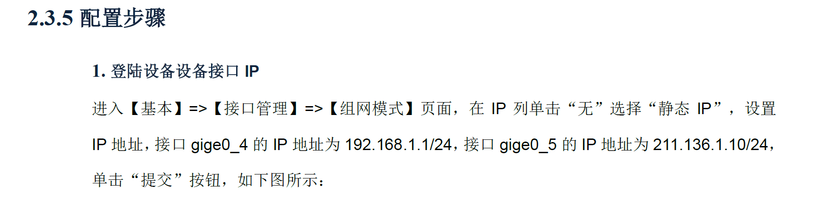
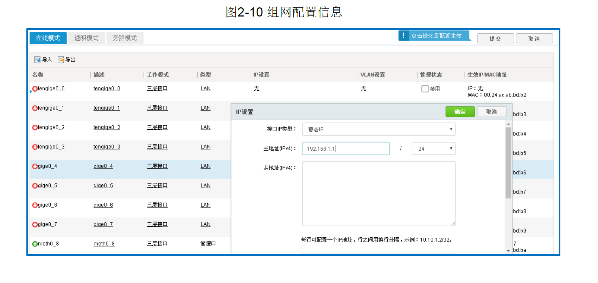
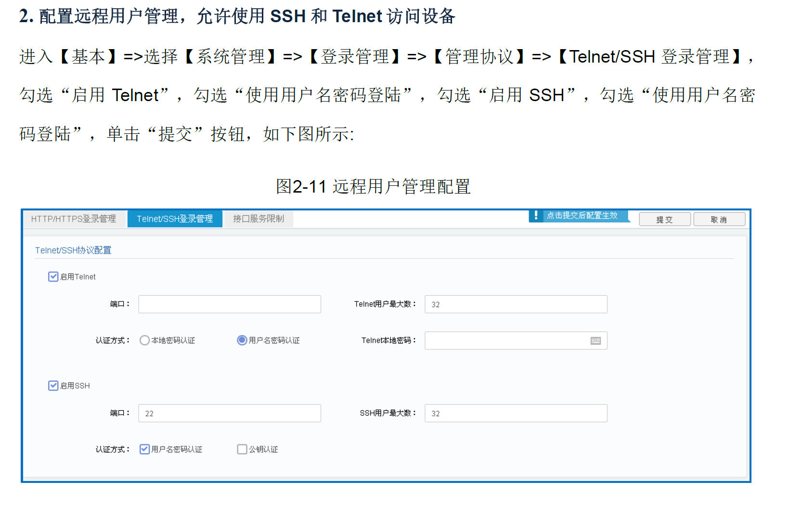
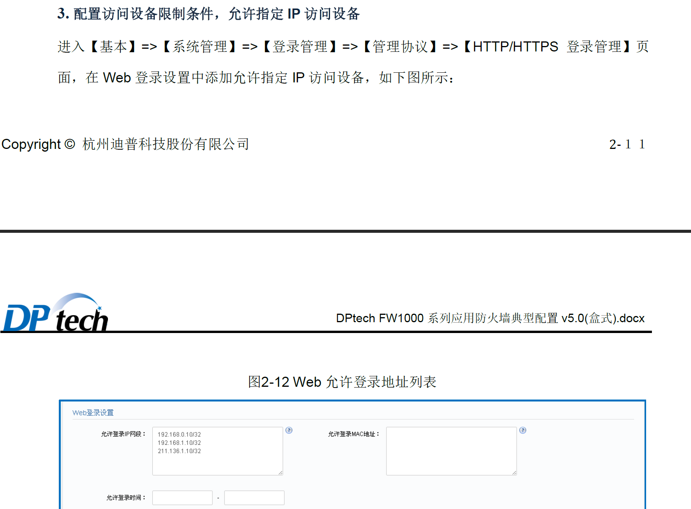
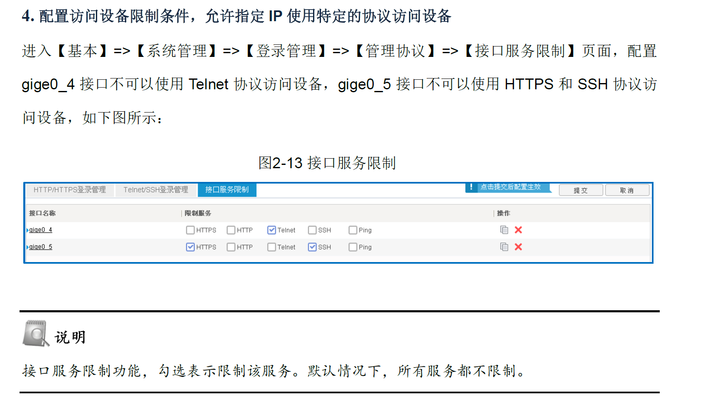
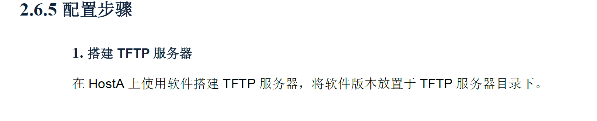
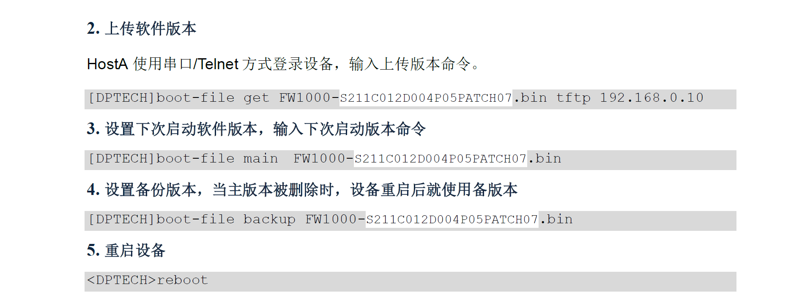

# 实施 1：限制特定 IP/特定协议管理防火墙

## 配置接口 IP

## 配 SSH 和 Telnet 用户名密码登录

## 在设备上添加类似白名单 IP 和 MAC 访问的操作，在接口上设置服务限制 http,https,默认什么都不限制

## 验证连通性

# 实施 2 ：导入和载入防火墙的配置

# 实施 3：Web 页面升级防火墙或者通过命令行的方式(tftpd64)

# 实施 4： 设置 trust,untrust,DMZ 非军事化区域安全域

## [安全域](./安全域DMZ.md)

# 实施 5： 包过滤防火墙的实施

## [包过滤防火墙](./包过滤.md)

# 实施 6： NAT 配置

## [NAT](./NAT.md)
