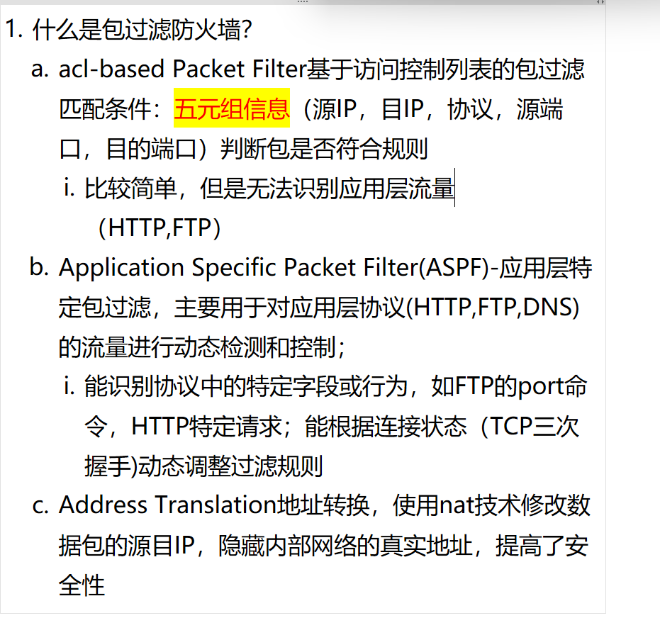
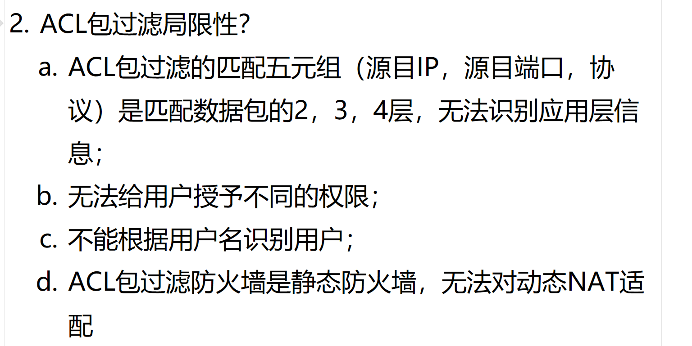

# 1. 包过滤防火墙？

<!-- en-interview -->
### English Interview

**Question:** What is a packet filtering firewall?

**Answer:**

 ACL-based packet filtering, which uses the five-tuple—source IP, destination IP, protocol, source port, and destination port—to make decisions. It’s simple but can’t identify application-layer traffic like HTTP or FTP.

# 2.包过滤防火墙局限性？

<!-- en-interview -->
### English Interview

**Question:** What are the limitations of packet-filtering firewalls?

**Answer:**

Packet-filtering firewalls, like ACLs, have several key limitations. First, they operate at layers 2 to 4 of the OSI model, using the five-tuple (source/destination IP, source/destination port, protocol) to make decisions. This means they can't inspect or understand application-layer content, so they can’t detect things like malware in HTTP traffic or control specific applications like Skype or video streaming. Second, they don’t support user-based policies — you can’t grant different permissions to different users. For example, you can’t allow Alice to access a web server but block Bob, even if they’re using the same IP. Third, they can’t identify users by username; they only see IP addresses and ports. Finally, because they’re stateless and static, they struggle with dynamic NAT environments. For instance, when multiple internal users share one public IP with changing port assignments, traditional ACLs can’t dynamically track or manage these connections effectively, leading to either security gaps or overly restrictive rules.
