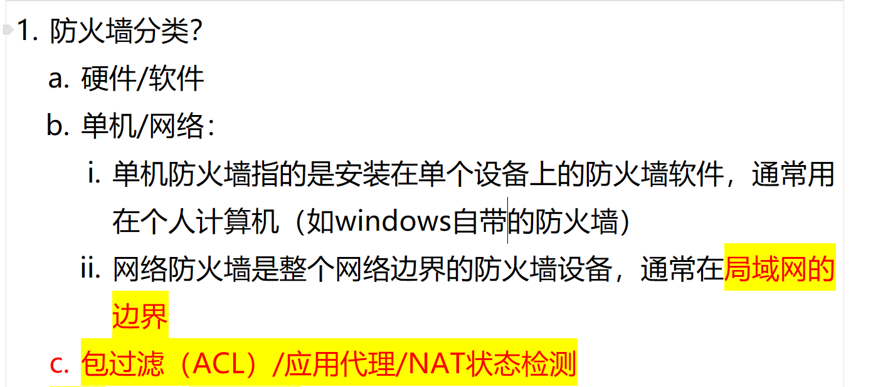
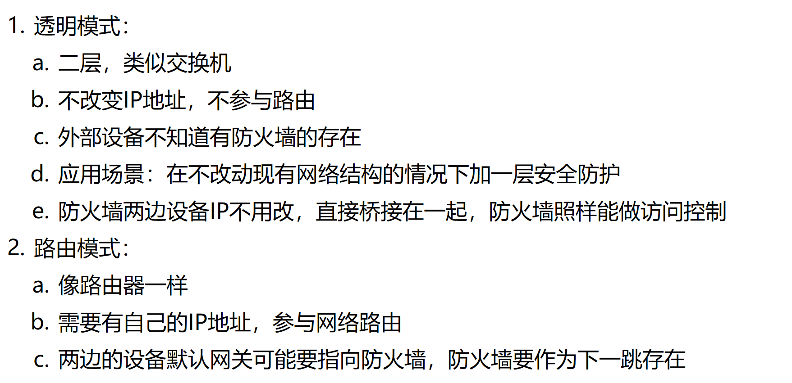
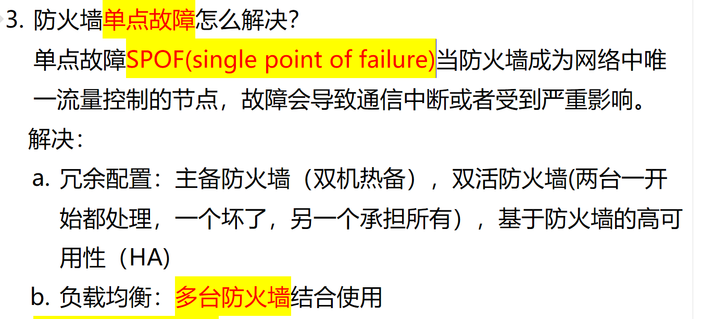
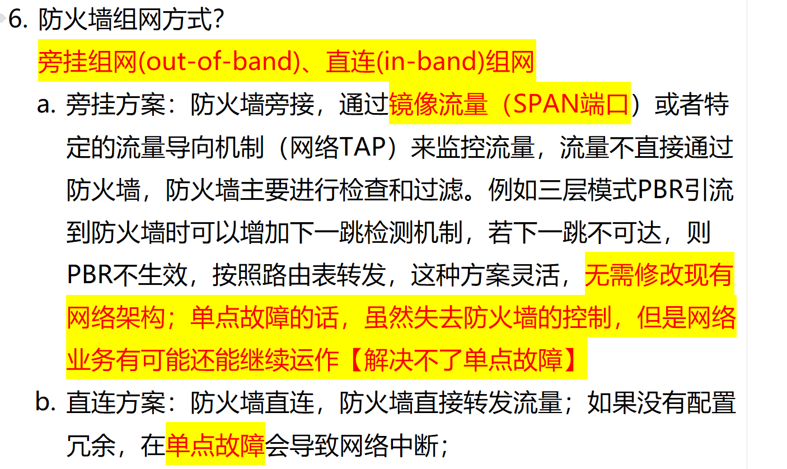

# 1. 防火墙分类？

<!-- en-interview -->
### English Interview

**Question:** What are the main classifications of firewalls?

**Answer:**

Firewalls can be categorized in several ways. First, by deployment type: hardware-based or software-based. Hardware firewalls are physical devices, while software firewalls run on general-purpose systems（通用系统）. Second, by scope: host-based (single-machine) or network-based. Host-based firewalls are installed on individual devices, like Windows Defender Firewall, protecting that specific machine. Network firewalls, on the other hand, are deployed at network boundaries（网络边界）—often at the edge of a local area network—to protect entire segments. Third, by technology or functionality: packet filtering (ACL), application proxy（应用代理防火墙）, and stateful inspection（状态检测防火墙） with NAT. Packet filtering checks IP addresses and ports based on rules. Application proxies inspect traffic at the application layer, offering higher security. 
# 2. 防火墙高可用方案？

<!-- en-interview -->
### English Interview

**Question:** What are the high availability deployment schemes for firewalls?

**Answer:**

For firewall high availability, the two main deployment models are HA (High Availability) and Active-Active. HA is the active-standby model, where one firewall is active and handles all traffic, while the other remains in standby mode, ready to take over if the primary fails. This setup ensures minimal downtime and is simpler to manage. The active firewall processes all network traffic, and the standby unit synchronizes configuration and session state to ensure seamless failover. On the other hand, Active-Active mode allows both firewalls to handle traffic simultaneously, increasing throughput and resource utilization. However, this model introduces complexity in management and synchronization, as both units must coordinate session states and load distribution to avoid conflicts. While Active-Active offers better performance, it requires more sophisticated configuration and monitoring. In practice, HA is often preferred for its simplicity and reliability, especially in environments where ease of management and quick failover are critical.

# 3. 防火墙工作模式？透明模式和路由模式的区别？

<!-- en-interview -->
### English Interview

**Question:** What are the operating modes of a firewall? What are the key differences between transparent mode and routing mode?

**Answer:**

Firewalls typically operate in two main modes: transparent and routing. In transparent mode, the firewall acts like a Layer 2 switch, bridging traffic between networks without changing IP addresses or participating in routing. Devices on either side remain unaware of the firewall’s presence, making it ideal for adding security without altering existing network topology. It performs access control based on MAC addresses, VLANs, or even application-layer policies without requiring IP address changes. In contrast, routing mode functions like a router—requiring its own IP address and actively participating in the routing process. Devices on both sides usually set the firewall as their default gateway, making it the next hop for traffic. This mode allows more granular control over routing policies and is commonly used in scenarios where network segmentation or policy-based routing is needed. So, transparent mode is stealthy and non-intrusive, while routing mode is more visible and control-oriented.

# 4. 防火墙怎么避免单点故障？防火墙旁挂？

<!-- en-interview -->
### English Interview

**Question:** How can firewalls avoid single point of failure? What about out-of-band firewall deployment?

**Answer:**

To avoid single point of failure, firewalls should be deployed with redundancy and high availability mechanisms. The core approach is to eliminate the dependency on a single device. This is typically achieved through active-standby or active-active configurations, where multiple firewalls work together—either one taking over if the other fails (active-standby), or both sharing the load (active-active). This ensures continuous operation even if one unit fails.

Another method is load balancing across multiple firewalls, distributing traffic to prevent overload and improve resilience. However, when deploying firewalls in an out-of-band or "bypass" mode—such as using SPAN ports or network TAPs—the firewall monitors traffic without being in the direct data path. While this setup is flexible and doesn’t require changes to existing network topology, it doesn’t prevent single point of failure because if the firewall fails, security controls are lost, even though network traffic might still flow. So, while it improves monitoring flexibility, it doesn’t solve the SPOF issue for security enforcement.
