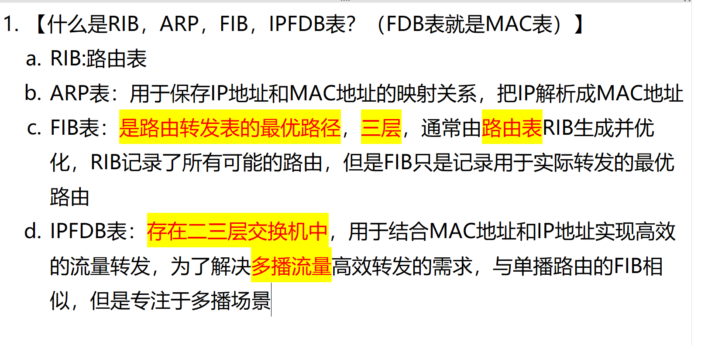

# 1. 什么是 RIB，ARP，FIB，IPFDB 表？（FDB 表就是 MAC 表）

**Question:** What are RIB, ARP, FIB, and IPFDB tables? (Note: FDB table is the MAC table.)

**Answer:**

RIB stands for Routing Information Base — it’s essentially the routing table that stores all possible routes learned from various protocols. Then we have ARP, which is the Address Resolution Protocol table; it maps IP addresses to MAC addresses so devices can communicate at Layer 2. FIB, or Forwarding Information Base, is the optimized version of RIB used for actual packet forwarding — it’s Layer 3, and only contains the best paths selected from RIB. Finally, IPFDB is used in Layer 2/3 switches to efficiently handle multicast traffic. It combines MAC and IP address information, similar to FIB but specifically designed for multicast scenarios. For example, in a video streaming environment, IPFDB helps forward multicast streams to only those devices that have subscribed, improving network efficiency. So, to sum up: RIB is the full routing database, FIB is the optimized forwarding table, ARP resolves IPs to MACs, and IPFDB enables efficient multicast forwarding.
