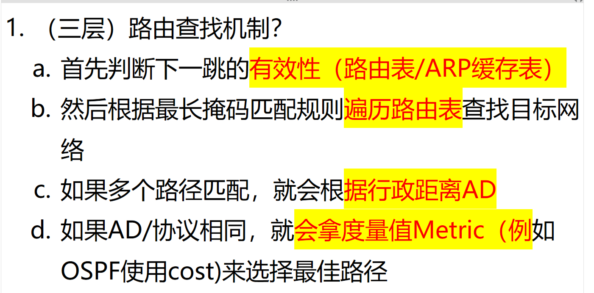
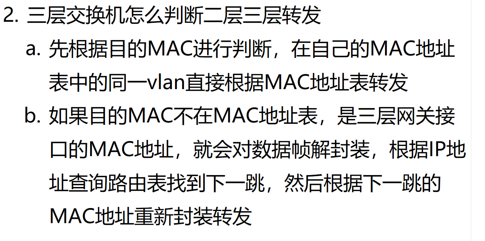

# 1. 什么是路由迭代规则？

<!-- en-interview -->
### English Interview

**Question:** What is the routing lookup process in Layer 3 forwarding?

**Answer:**

In Layer 3 routing, the lookup process determines the best path for forwarding packets. First, the router checks the validity of the next-hop address using the routing table and ARP cache to ensure the next-hop is reachable. Then, it applies the longest prefix match rule to scan the routing table for the most specific route to the destination network. If multiple routes match the destination, the router compares their Administrative Distance (AD), which indicates the trustworthiness of the routing protocol. For example, static routes typically have a lower AD than OSPF. If the AD values are the same, meaning routes come from the same protocol, the router then compares the metric values—like cost in OSPF—to pick the optimal path. The route with the lowest metric is selected. This step-by-step decision-making ensures efficient and reliable packet forwarding, prioritizing both reliability (via AD) and efficiency (via metric).

# 2. 三层交换机怎么判断是三层转发还是二层转发？

<!-- en-interview -->
### English Interview

**Question:** How does a Layer 3 switch determine whether to forward a packet at Layer 2 or Layer 3?

**Answer:**

A Layer 3 switch decides between Layer 2 and Layer 3 forwarding based on the destination MAC address and its MAC address table. First, it checks if the destination MAC is in the MAC table and belongs to the same VLAN as the incoming port. If yes, it forwards the frame at Layer 2 using the MAC table—this is typical switch behavior. However, if the destination MAC is not found in the table, or if it’s the MAC address of a Layer 3 interface (like a router interface or VLAN interface), the switch performs Layer 3 forwarding. It de-encapsulates the frame, examines the destination IP address, looks up the routing table to find the next hop, and then re-encapsulates the packet with the next hop’s MAC address before forwarding. This process allows the switch to route between different subnets while still using hardware-accelerated forwarding for same-subnet traffic, combining the speed of switching with routing intelligence.
