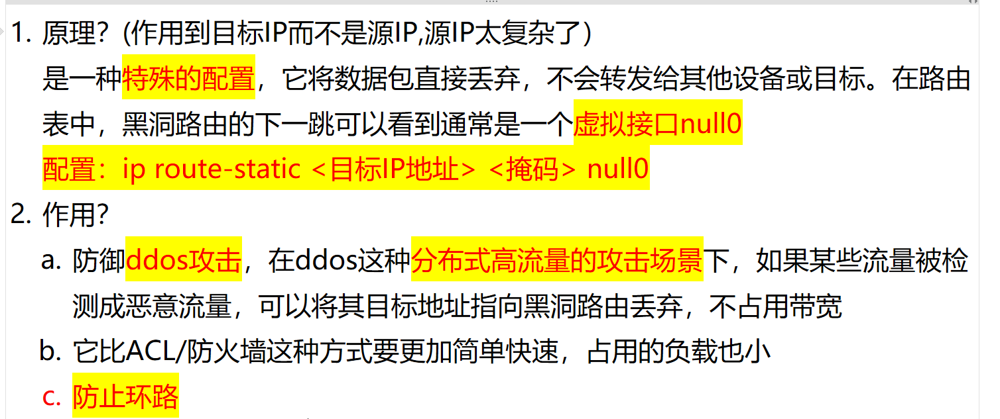

# 1. 黑洞路由是什么？怎么配？有什么作用？

<!-- en-interview -->
### English Interview

**Question:** What is a black hole route, how is it configured, and what are its main purposes?

**Answer:**

A black hole route is a special routing configuration that discards packets destined for specific IP addresses without forwarding them to any next hop. It’s commonly used in network defense and loop prevention（防环）. The key mechanism involves pointing the next hop of a static route to a **null interface**, typically called null0. The configuration syntax is straightforward: "ip route-static <destination IP> <subnet mask> null0".
